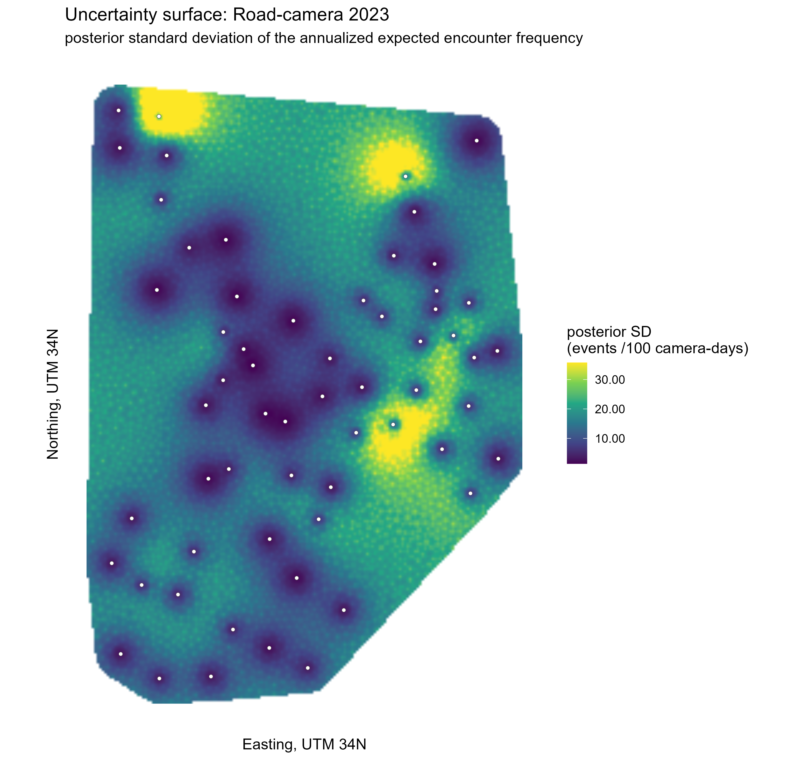
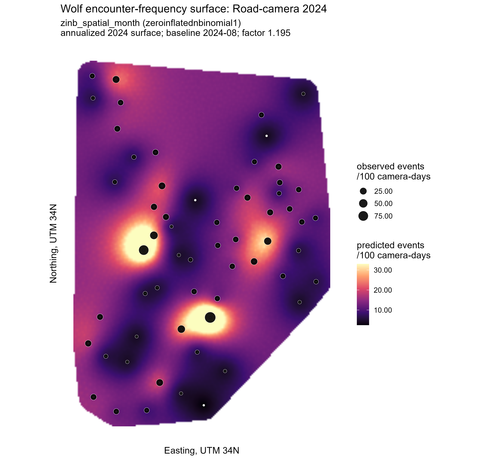
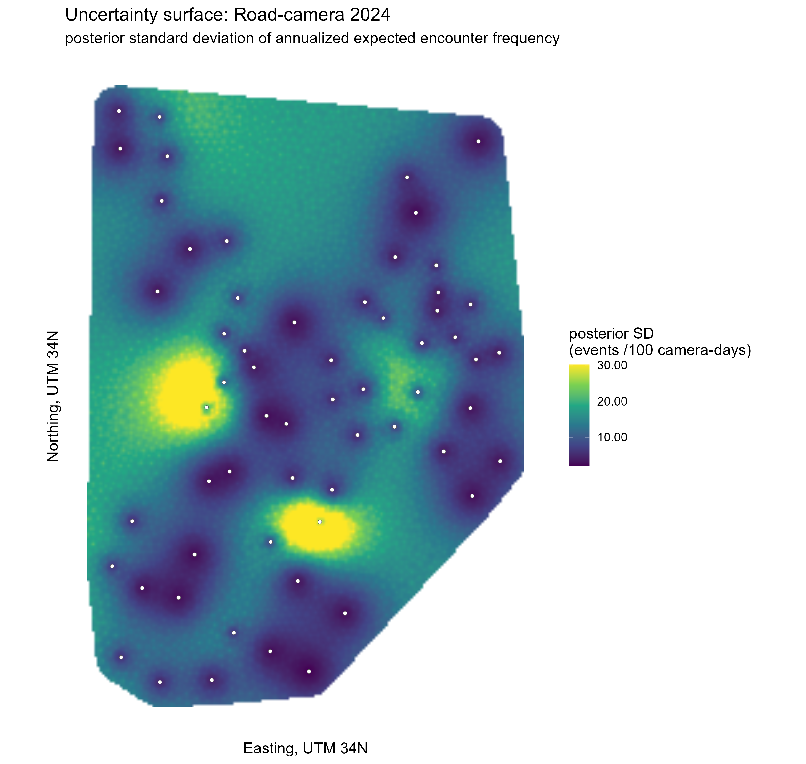

# Bayesian Spatial Encounter-Surface Models For 2023-2024 Wolf Camera-Trap Detections

This project contains the final 2023-2024 wolf relative encounter-frequency models
from camera-trap data. It is organized so a reader can understand the ecological
question, the input data structure, the three final statistical models, the
validation checks, and the outputs needed to reproduce or audit the analysis.

The analyses model the number of independent wolf event IDs recorded in
camera-month rows. The statistical approach is Bayesian count modelling with
INLA-SPDE spatial random fields. Active camera-days are used as an exposure
term, calendar month is included as a fixed temporal control, and outputs are
relative encounter-frequency surfaces expressed as expected wolf events per 100
camera-days across the sampled survey-year period. The maps should not be
interpreted as abundance, density, occupancy, or population size.

## Final Models

Three camera-specific analyses are included:

| Survey | Final model | Cameras | Events | Effort | Final output |
| --- | --- | ---: | ---: | ---: | --- |
| Road-camera 2023 | Negative-binomial spatial-month INLA-SPDE model | 60 | 586 | 5222.2 camera-days | `results/road_2023/` |
| Forest-camera 2024 | Negative-binomial spatial-month INLA-SPDE model | 53 | 46 | 4423.0 camera-days | `results/forest_2024/` |
| Road-camera 2024 | Zero-inflated negative-binomial spatial-month INLA-SPDE model | 60 | 479 | 3574.0 camera-days | `results/road_2024/` |

## Result Maps

Each survey below is mapped as a posterior-mean encounter-frequency surface
and a posterior-SD map, as matching GeoTIFF/PNG pairs. Both are expected
independent wolf events per 100 camera-days, effort-weighted and annualized
over that survey's sampled months (see
[Model Structure And Camera-Month Rows](#model-structure-and-camera-month-rows)
below) -- not abundance, density, occupancy, or population size. GeoTIFFs for
GIS use are in the same result folders as these PNGs.

### Road-Camera 2023

| Posterior mean | Posterior SD |
| --- | --- |
|  |  |

### Forest-Camera 2024

| Posterior mean | Posterior SD |
| --- | --- |
|  |  |

### Road-Camera 2024

| Posterior mean | Posterior SD |
| --- | --- |
|  |  |

## Model Structure And Camera-Month Rows

Each model is fit on camera-month rows: one row per camera per calendar
month, holding that camera's active camera-days (`E_i`, the exposure), its
location (`s_i`), and the wolf events assigned to that month (`y_i`). A
deployment spanning a month boundary is split so events and effort stay
aligned to the right month.

The shared linear predictor is:

```text
log(mu_i) = log(E_i) + beta_0 + gamma[m_i] + u(s_i)
```

`beta_0` is the intercept, `gamma[m_i]` is a fixed calendar-month effect, and
`u(s_i)` is a spatial INLA-SPDE random field shared by nearby cameras. The
forest-camera 2024 and road-camera 2023 models use a negative-binomial
likelihood; the road-camera 2024 model additionally uses INLA's
zero-inflated negative-binomial (`zeroinflatednbinomial1`) likelihood.

Month stays in the model as a fixed effect (residual diagnostics showed
temporal structure when it wasn't handled explicitly), but each survey's
published map is not a single-month prediction: it's an effort-weighted
annualized surface combining all of that survey's sampled months. See
[Data Units: Camera-Month Rows](docs/final-model-details.md#data-units-camera-month-rows)
and [Annualized Map Surface](docs/final-model-details.md#annualized-map-surface)
in `docs/final-model-details.md` for the full definition, formula, and a
worked example. The mapped central estimate is the posterior mean; the
posterior-SD map is its matching uncertainty surface.

## Repository Layout

```text
CameraSpatialEncounterSurfaces2023_2024/
  README.md
  data/
    README.md
  docs/
    final-model-details.md
  results/
    README.md
    road_2023/
    forest_2024/
    road_2024/
  scripts/
    wolf_2023_nb_month_split_workflow.R
    wolf_forest_month_refit.R
    wolf_2024_zinb_month_split_workflow.R
    wolf_relative_frequency_inla_helpers.R
```

Raw camera-trap CSV files are not committed here. The `data/README.md` file
lists the expected input files and where to place them for reproduction.

## Main Scripts

### Road-Camera 2023 Final Model

```sh
Rscript scripts/wolf_2023_nb_month_split_workflow.R
```

Final model:

- likelihood: negative binomial;
- spatial component: INLA-SPDE spatial random field;
- temporal component: calendar-month fixed effects;
- effort component: active camera-days are included as exposure;
- map target: effort-weighted annualized 2023 surface;
- priors: weakly informative Gaussian and PC priors.

### Forest-Camera 2024 Final Model

```sh
Rscript scripts/wolf_forest_month_refit.R
```

Final model:

- likelihood: negative binomial;
- spatial component: INLA-SPDE spatial random field;
- temporal component: calendar-month fixed effects;
- effort component: active camera-days are included as exposure;
- map target: effort-weighted annualized 2024 surface;
- priors: weakly informative Gaussian and PC priors.

### Road-Camera 2024 Final Model

```sh
Rscript scripts/wolf_2024_zinb_month_split_workflow.R
```

Final model:

- likelihood: zero-inflated negative binomial type 1;
- spatial component: INLA-SPDE spatial random field;
- temporal component: calendar-month fixed effects;
- effort component: active camera-days are included as exposure;
- map target: effort-weighted annualized 2024 surface;
- priors: weakly informative Gaussian and PC priors, including a weakly
  informative zero-inflation prior.

## Runtime Profiles

All workflows use the `WOLF_RUN_PROFILE` environment variable:

```sh
# Fast development run
WOLF_RUN_PROFILE=quick

# Recommended reproducible analysis
WOLF_RUN_PROFILE=balanced

# Heavier final run with more posterior simulations
WOLF_RUN_PROFILE=final
```

On Windows PowerShell, for example:

```powershell
$env:WOLF_RUN_PROFILE = "balanced"
& "C:\Program Files\R\R-4.5.2\bin\Rscript.exe" scripts\wolf_2024_zinb_month_split_workflow.R
```

Path overrides are available:

```powershell
$env:WOLF_PROJECT_DIR = "C:\path\to\CameraSpatialEncounterSurfaces2023_2024"
$env:WOLF_DATA_DIR = "C:\path\to\CameraSpatialEncounterSurfaces2023_2024\data"
$env:WOLF_OUTPUT_DIR = "C:\path\to\outputs"
```

## Key Results

Full diagnostic numbers, priors, model-comparison tables, and methodology
(including what "required diagnostics pass" means) are in
[`docs/final-model-details.md`](docs/final-model-details.md), stated once
there rather than repeated here. Headline results:

| Survey | Likelihood | Required diagnostics | Open caveat |
| --- | --- | --- | --- |
| Road-camera 2023 | Negative-binomial | Pass | None: no residual temporal autocorrelation detected |
| Forest-camera 2024 | Negative-binomial | Pass | Only 46 independent events, so posterior uncertainty on month/spatial effects is wide |
| Road-camera 2024 | Zero-inflated negative-binomial | Pass | Residual temporal autocorrelation of unestablished cause (mechanism tested and ruled out); cross-validation and mesh sensitivity indicate it does not distort the mapped surface |

For each survey, model comparison by WAIC selects the likelihood shown above
over the simpler Poisson alternative, and (for road-camera 2023) over the
marginally-better-fitting but harder-to-justify ZINB alternative; see
`docs/final-model-details.md` for the comparison tables.

## Outputs Included Here

Across the final-results folders, the curated outputs include:

- final validation report;
- posterior predictive checks;
- hyperparameter summaries;
- month-effect summaries;
- prior sensitivity reports and tables;
- mesh sensitivity reports and tables for all three analyses;
- model-comparison report and table for the road-camera models;
- spatial block cross-validation summaries;
- temporal residual diagnostics;
- posterior mean encounter-frequency map as PNG and GeoTIFF;
- posterior-SD uncertainty map as PNG and GeoTIFF.

The full generated output folders also contain exploratory plots, full
prediction grids, and additional intermediate diagnostics. Those full scratch
archives are not part of the curated GitHub result set.

## Methodology And References

`docs/final-model-details.md` has the full methodology (SPDE spatial fields,
priors, the diagnostic gate, sensitivity checks) with citations to the
underlying statistical and ecological literature for each method used, and a
full reference list at the end of that file.

## Required R Packages

- `readr`
- `dplyr`
- `tidyr`
- `sf`
- `terra`
- `ggplot2`
- `viridis`
- `scales`
- `INLA`

The scripts do not install packages automatically unless explicitly changed by
the user. INLA usually requires installing from the INLA repository.

## Reproducibility

INLA results can shift across package versions and INLA builds, and this
repository does not pin one. To make a specific run reproducible:

- Run `Rscript scripts/capture_session_info.R` in the same R environment used
  for a final run and commit the resulting `results/session_info.txt`. It
  records `sessionInfo()` plus the exact INLA package version and build.
- For a fuller environment pin, initialize [`renv`](https://rstudio.github.io/renv/)
  in this project (`renv::init()`) and commit the generated `renv.lock`.

A small synthetic sample dataset is included under `data/sample/` (see
`data/README.md`) so the pipeline can be run end-to-end without the private
survey CSVs, for structural checks rather than reproducing the reported
results.
